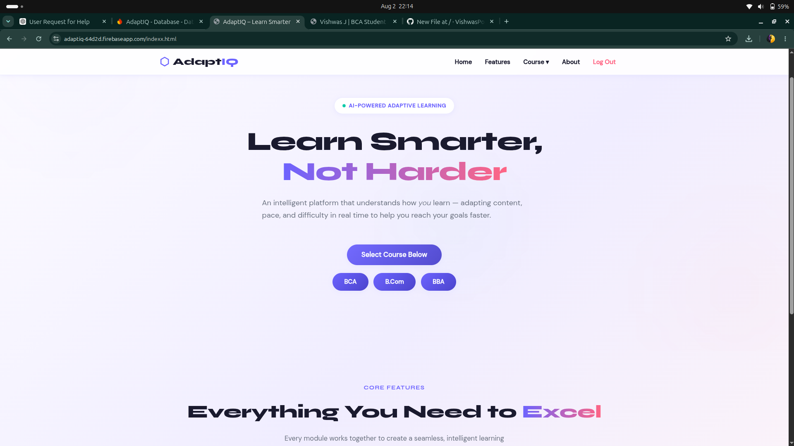
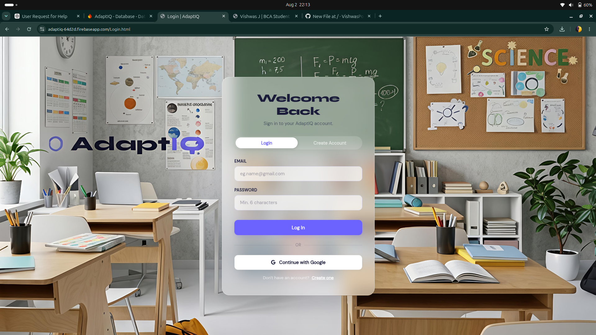
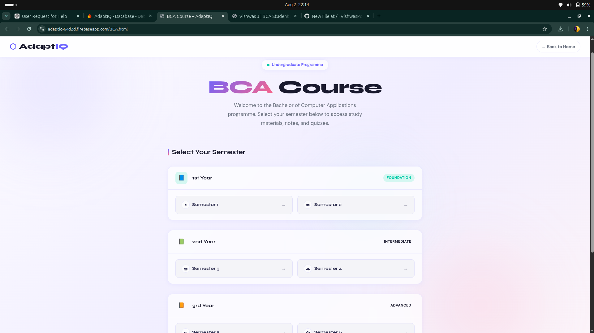

# 🎓 AdaptIQ

> An AI-powered adaptive learning platform designed to provide students with an engaging and personalized learning experience through academic resources, quizzes, authentication, and cloud-based services.

🌐 **Live Demo:**  
https://vishwaspoojary.github.io/AdaptIQ/

📂 **GitHub Repository:**  
https://github.com/VishwasPoojary/AdaptIQ

---

## 👥 Project Team

This project was collaboratively developed by:

- **Rynal D'Souza**
- **Ranjith Shettigar**
- **Vishwas.J**
- **Amith Shetty**
- **Srajan Acharya**

---

# ✨ Features

- 🔐 User Registration & Login
- 🔑 Google Sign-In using Firebase Authentication
- 📚 Subject-wise Academic Notes
- 📝 Interactive Quiz System
- 🎯 Personalized Learning Platform
- 📱 Responsive User Interface
- ☁️ Cloud-Based Authentication
- 📤 File Upload Support
- 📂 Backend API Integration

---

# 🛠️ Tech Stack

## Frontend
- HTML5
- CSS3
- JavaScript

## Backend
- Node.js
- Express.js

## Database
- MongoDB Atlas
- Mongoose

## Authentication
- Firebase Authentication

## Cloud Services
- Cloudinary

## File Upload
- Multer
- Multer Storage Cloudinary

## Additional Libraries
- CORS
- dotenv
- node-fetch

---

# 📂 Project Structure

```
AdaptIQ/
│
├── backend/
│   ├── server.js
│   ├── package.json
│   ├── setup-atlas.js
│   ├── fetch_notes.js
│   └── uploads/
│
├── web-app/
│
├── Login.html
├── index.html
├── indexx.html
├── quiz.html
├── notes.html
├── firebase.json
├── style.css
└── README.md
```

---

# 🚀 Getting Started

## Clone the Repository

```bash
git clone https://github.com/VishwasPoojary/AdaptIQ.git
```

## Navigate to the Project

```bash
cd AdaptIQ
```

## Install Backend Dependencies

```bash
cd backend
npm install
```

## Configure Environment Variables

Create a `.env` file inside the `backend` directory and add:

```env
MONGODB_URI=your_mongodb_connection_string
CLOUDINARY_CLOUD_NAME=your_cloud_name
CLOUDINARY_API_KEY=your_api_key
CLOUDINARY_API_SECRET=your_api_secret
```

## Run the Backend

```bash
npm start
```

Open `index.html` in your browser or deploy the frontend using GitHub Pages.

---

# 📸 Screenshots

## 🏠 Home Page


## 🔐 Login Page


## 📝 Class Page




---

# 🔮 Future Enhancements

- 🤖 AI-powered learning recommendations
- 📊 Student progress dashboard
- 🏆 Leaderboard and achievements
- 📈 Performance analytics
- 👨‍🏫 Admin panel
- 📅 Study planner
- 📱 Progressive Web App (PWA)

---

# 🤝 Contributing

Contributions, suggestions, and improvements are welcome. Feel free to fork the repository and submit a pull request.

---

# 👨‍💻 Author

**Vishwas J**

- GitHub: https://github.com/VishwasPoojary
- LinkedIn: https://www.linkedin.com/in/vishwas-poojary-819846378/

---

# 📄 License

This project is intended for educational and learning purposes.
